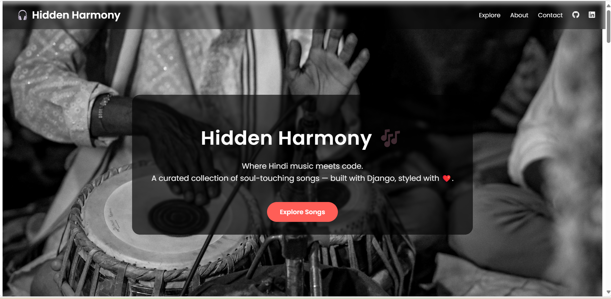
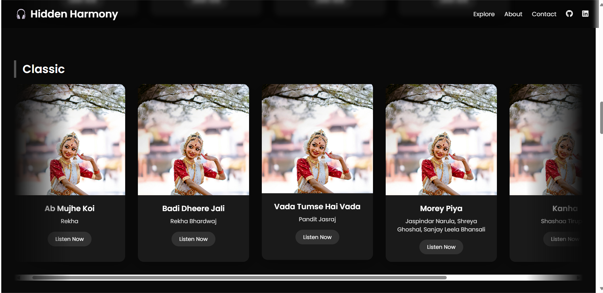
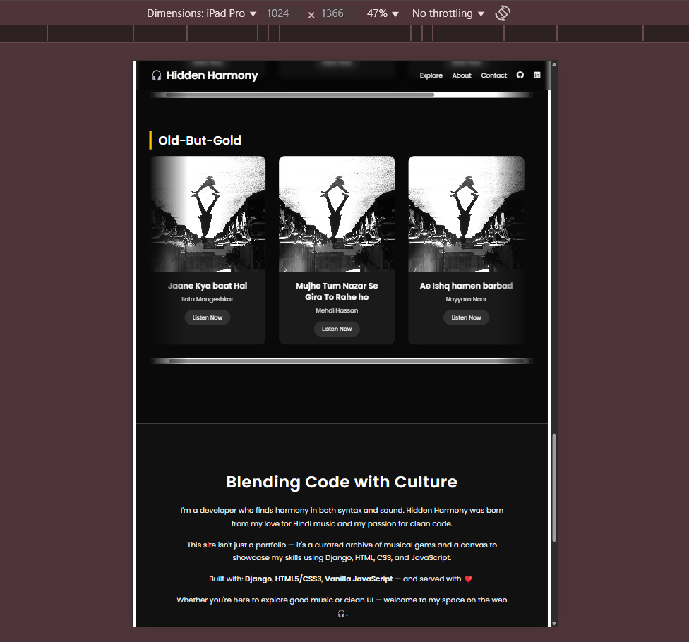

# 🎧 Hidden Harmony — A Musical Portfolio Crafted with Code

> "Where Hindi music meets Django — built with love, code, and a lot of late nights."

---

## 🌟 What is Hidden Harmony?

**Hidden Harmony** is more than a portfolio — it’s a soulful blend of music curation and full-stack web development.

- 🎶 Built using **Django**
- 🎨 Styled from scratch with **HTML, CSS, and JavaScript**
- 📱 Fully **responsive** (desktop, tablet, iPad tested)
- 🎯 Features a smooth **scrolling UI**, mood-wise song grouping, and custom theming

This is my **first personal portfolio project**, and every line of code reflects my love for clean design, emotional storytelling through music, and real-world development.

---

## 🔥 Features

- **Horizontal Scroll Mood Tiles**: Songs grouped and displayed by mood (e.g., Romantic, Chill, Melancholy)
- **Dynamic Song Management**: Add, edit, delete songs through Django Admin
- **Custom Hero + Footer**: Sticky header, CTA buttons, animated footer reveal
- **Professional Navbar**: GitHub, LinkedIn, internal smooth-scroll nav
- **Responsive Design**: Works beautifully on laptops, iPads & large screens

---

## 🛠️ Tech Stack

| Layer        | Tech Used                             |
|--------------|----------------------------------------|
| 🧠 Backend   | Django, Python                         |
| 💄 Frontend | HTML5, CSS3 (manual), JavaScript       |
| 🎨 Styling   | Custom gradients, transitions, animations |
| ⚙️ Admin    | Django Admin Panel                     |
| 📁 Assets    | Manually added images, favicon, logos |
| 🔐 Security  | `.env`, `SECRET_KEY`, `.gitignore`     |

---

## 🚀 Setup Guide

```bash
git clone https://github.com/Paiminashaikh/hiddenharmony.git
cd hiddenharmony
python -m venv venv
source venv/bin/activate     # For Windows: venv\Scripts\activate
pip install -r requirements.txt

# Set up environment
cp .env.example .env          # or manually create .env
# Add SECRET_KEY and DEBUG=True

python manage.py migrate
python manage.py createsuperuser
python manage.py runserver


## 🧪 Live Preview

> Not deployed yet. Run locally and explore the smooth UI, structured song tiles, and beautiful section transitions.

## 📷 Screenshots

<details>
  <summary>📌 Hero Section</summary>
  
</details>

<details>
  <summary>🎵 Song Tiles</summary>
  
</details>

<details>
  <summary>📱 Responsive View</summary>
  
</details>


## 👤 Author

**Paimina Shaikh**  
🎓 Self-taught full-stack enthusiast  
🎧 Believer in beauty of code and melody  
🔗 [GitHub](https://github.com/Paiminashaikh) | [LinkedIn](https://linkedin.com/in/paimina-shaikh)
